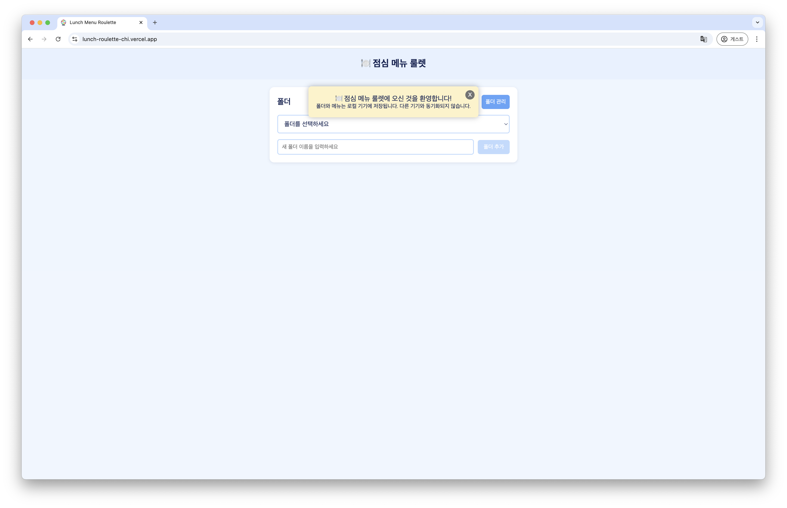
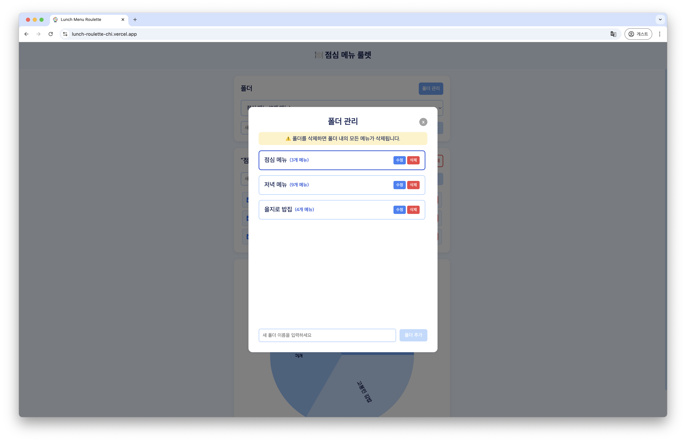
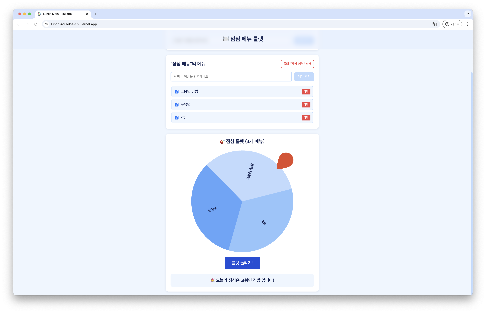

# Lunch Roulette 

Lunch Roulette is a fun web application that helps you decide what to eat for lunch by spinning a customizable roulette. Easily manage your menus and folders, spin the roulette, and let luck choose your next meal!

## 🚀 Web Address

Check out the live app here: [https://lunch-roulette-chi.vercel.app/](https://lunch-roulette-chi.vercel.app/)

## 🛠️ Tech Stack

- **React** 
- **TypeScript**
- **Zustand** (state management)
- **styled-components** (styling)

## ✨ Features

### 1. How to Use the Roulette
- **Add Folder:** Create a new folder for your menus.
- **Add Menu:** Add menu items to a specific folder.
- **Spin Roulette:** Click to spin and let the app pick your lunch!

### 2. Folder and Menu Management
- **Manage folders** in a dedicated folder management modal.
- **Choose menu participation:** For each folder, you can select whether menus added are included in the roulette spin.
  > ⚠️ Data will NOT sync across different devices or browsers.

## 📋 Usage

1. **Add Folder**: Create a new folder for your menus.
2. **Add Menu**: Add menu items to a specific folder.
3. **Spin Roulette**: Click to spin and let the app pick your lunch!
4. **Manage Folders**: Open the folder management modal to edit or delete folders.
5. **Select Menus**: Toggle which menus are included in the roulette for each folder.

## 📷 Screenshots

